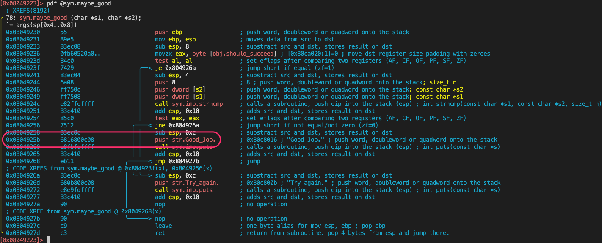

# 01_angr_avoid CTF 挑战：路径规避

## 挑战概述

`01_angr_avoid` 是 angr CTF 系列的第二个挑战，它在 `00_angr_find` 的基础上引入了**路径规避**的概念。您的目标是找到一个特定的输入，使得编译后的二进制程序能够输出 "Good Job."，同时**避免**执行导致失败的特定代码路径。

这个挑战将帮助您掌握 `angr.SimulationManager` 中 `explore()` 方法的 `avoid` 参数，从而更精确地控制符号执行的探索方向。

您可以通过[这里](https://www.tjc.im/reverse_engineering/angr_ctf/01_angr_avoid/#analyzing-the-binary)查看一篇别人写的笔记。

## 学习前置知识

在解决此挑战之前，请确保您已理解并掌握 `00_angr_find` 挑战中的所有概念和技术。特别是：

*   angr 项目的创建和加载。
*   `SimState` 的基本操作。
*   `SimulationManager` 的基本使用和 `explore()` 方法的 `find` 参数。
*   如何使用反汇编工具查找目标地址。

## 核心学习重点

为了成功解决 `01_angr_avoid` 挑战并深入理解 angr，请重点学习以下概念和 angr 文档章节：

1.  **路径探索的精细控制**
    *   **学习目标**：理解 `angr.SimulationManager` 的 `explore()` 方法如何通过 `find` 和 `avoid` 参数来引导符号执行。`find` 参数用于指定希望到达的地址，而 `avoid` 参数用于指定希望规避的地址。这使得符号执行能够更高效地找到所需路径并规避不希望的路径。
    *   **推荐阅读**：[Simulation Managers](https://docs.angr.io/en/latest/core-concepts/pathgroups.html) (特别是关于 `.explore()` 方法中 `find` 和 `avoid` 参数的部分)

2.  **程序流分析**
    *   **学习目标**：通过阅读 C 源代码或反汇编，识别程序中导致不同输出（成功或失败）的关键函数或代码块的地址。这对于正确设置 `find` 和 `avoid` 地址至关重要。

3.  **符号化 stdin 的正确方式**
    *   **学习目标**：理解如何使用 `SimPackets` 正确配置符号化的标准输入，这是约束输入条件的关键。
    *   **推荐阅读**：[Working with File System](https://docs.angr.io/en/latest/advanced-topics/file_system.html#example-6-working-with-streams-simpackets)

## 技术要点详解

*   **确定 `find` 地址**：
    *   通常是程序中打印 "Good Job." 字符串的指令地址。您需要使用反汇编工具（如 `objdump`、`radare2`、IDA Pro、Ghidra）来查找。
*   **确定 `avoid` 地址**：
    *   通常是程序中打印 "Try again." 或导致程序进入死胡同的指令地址。在 `01_angr_avoid` 挑战中，您会发现一个明确的 `avoid_me()` 函数，其地址就是您需要规避的。
*   **`angr.SimulationManager.explore()` 方法**：
    *   `simgr.explore(find=target_address, avoid=undesired_address)`: 这是解决此挑战的核心。angr 将尝试找到一条路径，该路径会到达 `target_address`，同时不会经过 `undesired_address`。

### **配置符号化 stdin：理解 SimPackets**

当您需要约束 stdin 输入时，必须正确使用 `SimPackets`。

#### 为什么使用 SimPackets？

angr 中 stdin 默认就是 `SimPackets` 类型（而非 `SimFile` 或 `SimFileStream`）。SimPackets 将输入建模为**一系列数据包**，每个 packet 对应程序的**一次读取操作**（如一次 `scanf` 或 `read` 调用）。

#### 基本用法

```python
# 1. 创建符号变量
password_length = 8
symbolic_password = claripy.BVS('password', 8 * password_length)

# 2. 使用 SimPackets 配置 stdin
# 格式: content=[(bitvector, length_in_bytes)]
initial_state = project.factory.entry_state(
    stdin=angr.SimPackets(name='stdin', content=[(symbolic_password, password_length)])
)

# 3. 添加约束（可选）
for i in range(password_length):
    byte = symbolic_password.get_byte(i)
    initial_state.solver.add(byte >= ord('A'))
    initial_state.solver.add(byte <= ord('Z'))
```

#### 关键规则：Packets 数量 = 读取次数

| 程序代码 | Packets 配置 |
|---------|-------------|
| `scanf("%s", buf);` | 1 个 packet |
| `scanf("%s", a); scanf("%s", b);` | 2 个 packets |
| `scanf("%u %s", &n, buf);` | 1 个 packet (单次调用) |

**示例 1 - 单次读取（01_angr_avoid 的情况）：**
```python
# 程序只调用一次 scanf
password = claripy.BVS('password', 8 * 8)
stdin=angr.SimPackets(name='stdin', content=[
    (password, 8)  # 一个 packet
])
```

**示例 2 - 多次读取：**
```python
# 程序调用两次 scanf
user = claripy.BVS('user', 16 * 8)
pwd = claripy.BVS('pwd', 16 * 8)
stdin=angr.SimPackets(name='stdin', content=[
    (user, 16),  # 第一次 scanf 读取
    (pwd, 16)    # 第二次 scanf 读取
])
```

#### 常见错误 ❌

```python
# ❌ 错误：将单次读取分成多个 packets
password = claripy.BVS('pwd', 7 * 8)
extra = claripy.BVS('extra', 1 * 8)
stdin=angr.SimPackets(content=[
    (password, 7),  # 第一个 packet
    (extra, 1)      # ← 永远不会被读取！
])
# 如果程序只调用一次 scanf，它只会读取第一个 packet
```

#### 不需要手动配置的情况

如果您**不需要约束输入**，可以完全省略 `stdin` 参数：
```python
# 最简单的方式 - angr 自动创建无限符号 stdin
initial_state = project.factory.entry_state()
```

## 为什么需要 `avoid` 参数？详解

很多初学者会问：既然我们已经设置了正确的 `find` 目标地址，为什么还需要额外设置 `avoid` 参数来规避某些路径呢？

### 1. **性能优化：避免路径爆炸**

**不使用 `avoid` 参数的问题**：
```python
# 只有 find 参数 - 会工作但效率很低
simulation.explore(find=print_good_address)
```
- angr 将会探索从入口点开始的**所有可能路径**
- 包括那些最终会失败或进入死胡同的路径
- 对于复杂二进制文件，这可能导致：
  - **路径爆炸**：路径数量呈指数级增长
  - **内存消耗**：需要跟踪成百上千个无效状态
  - **求解时间延长**：在无用的路径上浪费计算资源

**使用 `avoid` 参数的优势**：
```python
# 同时使用 find 和 avoid 参数 - 高效且精确
simulation.explore(find=print_good_address, avoid=will_not_succeed_address)
```
- angr **立即丢弃**任何会到达 `avoid_me()` 函数的路径
- 只专注于探索有希望成功的路径分支
- 通常能在几秒内找到解决方案

### 2. **引导式探索：提供方向性**

`avoid` 参数就像是为 angr 设置的"护栏"：

- **告诉 angr**："不要浪费时间探索这个区域"
- **引导探索**：专注于可能到达目标的路径
- **减少噪音**：避免分析无关的失败逻辑

### 3. **实际示例对比**

```python
# 方法一：仅使用 find（慢）
print_good_address = 0x0804925b
simulation.explore(find=print_good_address)
# 可能需要探索数百个状态，耗时几分钟

# 方法二：使用 find + avoid（快）
print_good_address = 0x0804925b
will_not_succeed_address = 0x08049223  # avoid_me 函数地址
simulation.explore(find=print_good_address, avoid=will_not_succeed_address)
# 通常只需要探索几个状态，几秒内完成
```

**总结**：`avoid` 参数不仅是一个可选功能，而是高效符号执行的关键工具。它通过剪除无效路径，大大提高了 angr 的求解效率和实用性。

## 实践步骤

1.  **分析二进制文件**：
    *   使用 `radare2` 查看二进制文件的函数列表。在终端中运行：
        ```bash
        r2 -q -c 'aaa 2>/dev/null; e scr.color=0; e asm.lines=false; afl' 01_angr_avoid/01_angr_avoid
        ```
    *   从输出中，找到 `sym.avoid_me` 函数的入口地址（作为 `avoid` 地址）。例如，在上述输出中，`avoid_me` 的地址是 `0x08049223`。
    *   查找可能打印 "Good Job." 字符串的函数。通常，这会是一个名称暗示成功（如 `maybe_good`）或直接处理输出的函数（如 `print_msg`）。确定这些函数的入口地址。在 `01_angr_avoid` 挑战中，`sym.maybe_good` (例如 `0x08049230`) 很可能是您要寻找的 `find` 地址。
    *   **确认 `find` 地址**：为了确认 `maybe_good` 函数是否是正确的 `find` 地址，您可以使用 `radare2` 查看其反汇编代码：
        ```bash
        r2 -q -c 'pdf @sym.maybe_good' 01_angr_avoid/01_angr_avoid
        ```
        
        在反汇编输出中，查找包含 "Good Job." 字符串引用的指令（例如 `push str.Good_Job.` 后跟 `call sym.imp.puts`）。如果找到，则确认 `maybe_good` 是正确的 `find` 地址。
2.  **修改 `scaffold01.py`**：
    *   将 `path_to_binary` 设置为正确的二进制文件路径（例如 `'./solutions/01_angr_avoid/01_angr_avoid'`）。
    *   将 `print_good_address` 设置为您在步骤 1 中找到的 "Good Job." 相关函数的地址（例如 `0x0804925b` - 注意，`maybe_good`函数中，并不是只要进入就表示正确的，这点和`avoid_me`不一样）。
    *   将 `will_not_succeed_address` 设置为您在步骤 1 中找到的 `avoid_me()` 函数的地址（例如 `0x08049223`。另外，根据如上截图，我们也可以考虑把 `0x0804926a` 加入到这里）。
3.  **运行解决方案**：
    *   执行您的 Python 脚本：`python scaffold01.py`
    *   脚本将输出找到的密码。

## 扩展学习

*   **angr 官方文档**：[angr Documentation](https://docs.angr.io/en/latest.md) - 完整的 angr 文档，包含所有模块和 API 细节。
*   **angr CTF 仓库**：[angr_ctf](https://github.com/jakespringer/angr_ctf) - 更多 angr CTF 挑战，可以帮助您进一步提升技能。
*   **angr Cheatsheet**：[Angr Cheatsheet](https://docs.angr.io/en/latest/appendix/cheatsheet.html) - 快速参考 angr 的常用功能和代码片段。

## 常见问题

*   **找不到解决方案**：
    *   检查 `find` 和 `avoid` 地址是否正确。
    *   确保二进制文件路径正确。
    *   对于更复杂的挑战，可能需要更深入地分析程序逻辑，以确定正确的规避点。
*   **配置 stdin 后无法找到解决方案**：
    *   确保 `password_length` 与程序实际读取的长度匹配（本挑战中必须是 8）。
    *   检查 packets 数量是否与程序的读取次数对应。
    *   如果不需要约束输入，尝试省略 `stdin` 参数让 angr 自动处理。
*   **`angr.options.SYMBOL_FILL_UNCONSTRAINED_MEMORY` 和 `SYMBOL_FILL_UNCONSTRAINED_REGISTERS`**：这些选项对于确保符号执行能够探索所有可能的路径至关重要。

祝您学习愉快，并在 angr 的世界中取得成功！