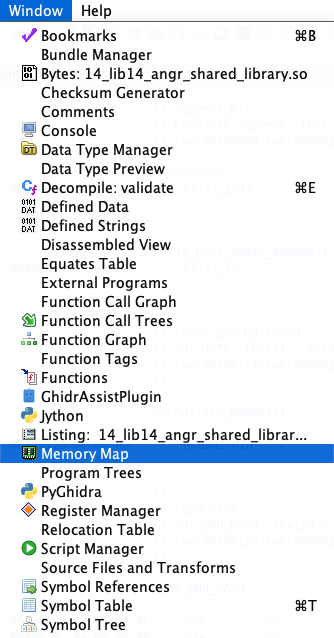

# 14_angr_shared_library：分析共享库（.so）的两把钥匙：base_addr 与 call_state

本关的特别之处不在于“解题逻辑”，而在于“对象类型”：这一次不是分析可执行文件（ELF main），而是直接分析一个共享库（ELF .so），并从其中的函数 validate(char*, int) 发起执行。要把它跑顺利，必须理解两件事：
- 为什么需要 base_addr（以及如何设置）
- 为什么需要 call_state（以及如何使用）


## TL;DR

- 直接对 .so 分析时，反汇编/符号表里给出的函数地址都是“相对装载基址”的偏移（offset）。你必须在加载时指定 base_addr，把“offset + base_addr”变成可执行内存里的“实际地址”。否则所有地址都对不上。
- 我们不是从 _start/main 起步，而是“像一次函数调用那样”从 validate 入口开始，这就要用 call_state。它会根据架构/默认调用约定布置栈帧/参数/返回，避免你手搓寄存器和堆栈。
- 传参要贴合原型：validate(char* buffer, int length)。buffer 指向 20 字节的用户输入（可用 BVS） - 注意，本节的源代码，虽然用户可以输入多达 20 字节，但是比较前八个字节，length 传 8 即可（validate 函数要求 length 不小于 8，但真正用于比较的是硬编码的 8 个字节长度）。地址可以选一个“干净的虚拟地址”并直接 store；或者用 angr 的分配接口拿一个有效地址。


## 1. 为什么需要 base_addr

共享库（.so）通常以位置无关代码（PIC）构建。逆向工具（r2）里的函数地址，默认是“相对装载基址”的偏移（offset）,而 Ghidra 则直接自己加了一个称作“Image Base“的可定制化 base。在真实运行时，动态装载器把 .so 映射到某个基址 base，函数的实际内存地址 = base + offset。

- 如果不在 angr 里指定 base_addr，分析状态中的“内存地址空间”和你从逆向工具拿到的“偏移地址”对不上，导致所有“跳到 validate”“在 strcmp 后打断点”的行为失效。
- base_addr 的“值”并不神秘：只要选一个对齐、干净、不冲突的虚拟地址即可（实践中常用 0x10000、0x400000 等）。
- 关键在“一致性”：你选了哪个 base，后续所有函数/探针/断点地址都必须用 base + offset 来写。

加载 .so 并设基址（与 scaffold14.py 一致）：
```python
base = 0x10000
project = angr.Project("binary/x32/lib14_angr_shared_library.so", load_options={
    "main_opts": {"base_addr": base}
})
```

如何获得 validate 的 offset？
- 用 r2：`r2 -q -c 'aaa; afl~validate' lib14_angr_shared_library.so`
- 用 readelf：`readelf -s lib14_angr_shared_library.so | grep validate`
- 用 Ghidra：直接查看函数 offset（Window -> Memory Map，然后选择“小房子“图标，就可以自定义：




```
[0x000006d7]> afl~validate
0x000006d7   10    173 sym.validate
```
示例中的 radare2 显示的 validate 偏移是 0x6d7，那么入口地址就是 base + 0x6d7。


## 2. 为什么要用 call_state（与 entry_state/blank_state 的区别）

- entry_state：从 ELF 入口开始（_start），会走运行时初始化/动态装载流程。适合“从程序最开始跑起”。但我们只关心 validate，走完整个初始化既慢又无关。
- blank_state：从任意地址起步，但你需要自己处理“调用约定”：参数如何传、返回地址怎么放到栈、栈指针怎么设置……手搓容易出错。
- call_state：这是“从函数入口发起一次调用”的状态构造。它会按架构默认的调用约定（如 x86 cdecl）把参数塞到栈/寄存器，同时设置返回地址，让你像“调用函数”一样起步，非常契合“从 validate 开始”的需求。

因此，本关最合适的就是 call_state(validate_addr, arg1, arg2, …)。


## 3. 如何决定 call_state 的参数与准备内存

validate 原型：`int validate(char* buf, int len)`

```c

/* WARNING: Function: __x86.get_pc_thunk.bx replaced with injection: get_pc_thunk_bx */

int validate(char *buf,int len)

{
  char *pcVar1;
  uint final_result;
  int result;
  char ref [20];
  int j;
  int i;

  if (len < 8) {
    final_result = 0;
  }
  else {
    for (i = 0; i < 0x14; i = i + 1) {
      ref[i] = '\0';
    }
    builtin_strncpy(ref,"PVBLVTFT",8);
                    /* 对 buf 进行逐字符变换 */
    for (j = 0; j < 8; j = j + 1) {
      pcVar1 = buf + j;
      result = complex_function((int)buf[j],j);
      *pcVar1 = (char)result;
    }
    result = strcmp(buf,ref);
    final_result = (uint)(result == 0);
  }
  return final_result;
}
```

- 第 1 参数：指向输入缓冲区的指针，长度 20；我们希望它指向一段“由符号变量构成的 20 字节数据”。
- 第 2 参数：8（可传 Python int 或 BVV(8, 32)）。

如何选择 buffer 的地址？
- SimMemory 是惰性分配的，只要你向一段“目前未使用的地址”写入数据（store），angr 会为你映射相应页。你可以选择一个干净虚拟地址（例如 0x200000）：
  ```python
  buffer_addr = 0x200000    # 自选的干净地址
  password = claripy.BVS("password", 8 * 8)
  state.memory.store(buffer_addr, password)
  ```
- 也可以使用一些“显式分配”的方式（如 heap.alloc/external object allocate 等），但对本关不是必须。
- 重要的是“一致性”：call_state 里的参数 buffer 指向哪儿，你存入符号变量就要存到“同一个地址”。

示例（对齐 scaffold14.py 思路，简洁版）：
```python
base = 0x10000
project = angr.Project("binary/x32/lib14_angr_shared_library.so",
                       load_options={"main_opts": {"base_addr": base}})

validate_addr = base + 0x6d7  # 以你的二进制为准

buffer_addr = 0x200000  # 自选干净地址
password = claripy.BVS("password", 8 * 8)

# 从 validate 函数入口起步，传入 (buffer_addr, 8)
state = project.factory.call_state(validate_addr, buffer_addr, 8)

# 准备输入数据
state.memory.store(buffer_addr, password)

simgr = project.factory.simgr(state)
```

上面与 scaffold14.py 的不同之处：
- scaffold 用了 “base - 30” 这种简写地址，也能工作（因惰性分配），但不如“挑选干净地址”直观。两者本质一致。


## 4. 何处加约束、如何搜索

validate 内部最终会执行 `strcmp(buffer, password)`，返回 0 表示相等。validate 返回的是 `!strcmp(...)`，即 1 表示成功。

两种常用方式：
- A. 找到“strcmp 调用后、返回值已放入 EAX”的点，把 EAX 约束为 0（strcmp 返回值 == 0），然后求解输入。
- B. 直接在 ret 前把 validate 的返回值（EAX）约束为 1（成功）。

scaffold14.py 的做法是 A：
```asm
        00000766 8d 45 dc        LEA        final_result=>ref,[EBP + -0x24]
        00000769 50              PUSH       final_result
        0000076a ff 75 08        PUSH       dword ptr [EBP + buf]
        0000076d e8 2e fd        CALL       <EXTERNAL>::strcmp                               int strcmp(char * __s1, char *
                 ff ff                                                                       __s2)
        00000772 83 c4 10        ADD        ESP,0x10
        00000775 85 c0           TEST       result,result
```

```python
check_addr = base + 0x772  # 这里示例指向如上“strcmp 执行完之后”的位置
simgr.explore(find=check_addr)

if simgr.found:
    s = simgr.found[0]
    # strcmp 返回 0 表示相等
    s.add_constraints(s.regs.eax == 0)
    sol = s.solver.eval(password, cast_to=bytes)
    print(sol)
```

注意：
- “strcmp 执行完之后”的偏移要从你的 .so 反汇编里确认。不同 seed/编译参数可能有微调。你可以用 r2/Ghidra 搜索字符串/交叉引用快速定位。
- 我们是直接调用 validate，而不是跑主程序，所以不建议用 stdout 的 Good Job/Try again 来做 find/avoid（当然也能做）。


## 5. 共享库中 libc 调用的处理

validate 内部调用了 `strncpy/strcmp/puts/printf` 等标准库函数。直接分析 .so 时：
- 如果这些函数以“外部导入符号”的形式存在，angr 往往能用自带的 SimProcedures 自动处理（不需要你手动 hook）。
- 如果是“内联/builtin_”形式（例如 builtin_strncpy），那就是普通代码，而非外部导入；angr 就直接执行对应代码片段，不需 hook。
- 若你需要更稳/更快，也可以手动 hook 这些 libc 函数为 angr 的 SimProcedures（如 SIM_PROCEDURES['libc']['strcmp']），但对本关不是必须。


## 6. 常见坑位与验证

- base_addr 与 offset：
  - 先确定 validate/strcmp 等函数的 offset，再用 base + offset 构造地址。
  - 若工具显示的是“重定位后的虚拟地址”，确认是否已经含 base（避免重复相加）。
- call_state 参数签名：
  - 与函数原型严格一致：validate(char*, int)。指针传指针值（32 位下 4 字节），整数传 32 位。
- 指针与位宽：
  - x86 32-bit：指针宽度 32 位（4*8）；claripy.BVV(addr, 32) 即可。把 Python int 直接作为参数也可（angr 会装配）。
- 内存写入：
  - store 到与参数一致的地址。不要把符号串存 A 地址，却把参数传 B 地址。
- “找到”的地址：
  - 使用 r2 交叉引用，确认 strcmp 调用返回点的偏移。比如：`r2 -q -c 'aaa; axt @ sym.imp.strcmp' lib...so`。
- 终点约束的选择：
  - 用 strcmp 返回 0（EAX==0）是一个清晰的选择；或用 validate ret==1（EAX==1）也可（前提是定位 ret 前的偏移）。


## 7. 参考 scaffold14.py 中的关键片段（对照说明）

- 设 base：
  ```python
  project = angr.Project(path_to_binary, load_options={"main_opts": {"base_addr": base}})
  ```
- validate 入口：
  ```python
  validate_function_address = base + 0x6d7
  ```
- 用 call_state 传参：
  ```python
  initial_state = project.factory.call_state(validate_function_address, buffer_pointer, 8)
  ```
- 准备输入、设置查找点、添加约束并求解：
  ```python
  initial_state.memory.store(buffer_pointer, password)
  simulation.explore(find=base + 0x772)
  solution_state.add_constraints(solution_state.regs.eax == 0)
  solution = solution_state.solver.eval(password, cast_to=bytes)
  print(solution)
  ```


## 8. 小结

- base_addr 的本质：把“偏移地址（offset）”翻译成“进程虚拟地址（base + offset）”，是让所有定位（函数入口、断点/探针）能生效的必要条件。
- call_state 的价值：用“函数调用”起步，而非“程序入口”起步；自动布置栈/参数/返回，专注函数语义，省心易控。
- 参数与内存：指针参数要指向你 store 符号串的地址；长度传 8；位宽 32 位。选一个干净地址即可（无须拘泥于具体数值）。
- 约束与终点：常用 strcmp 返回 0 或 validate 返回 1 作为约束点；按你的二进制确认 offset，再加 base。

做到“基址一致、参数正确、约束合理”，你就能稳定地把 .so 里的 validate 单独跑起来，并解出 8 字节密码。
